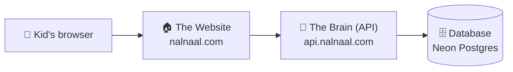

# Olympiad Trail — Architecture Guide

This explains how Olympiad Trail actually works behind the scenes, in plain
language first, then with the technical detail you need to actually make a
change, debug something, or deploy. Live at **https://nalnaal.com**.

## The big picture

Four things talk to each other. Here's the path a single click takes, from a
kid's screen to where their score actually gets remembered:



The Website never talks to the Database directly — only the Brain is allowed
to. Two more pieces sit around this chain: **GitHub** holds the code and its
full history, and **Cloudflare** hosts both the Website and the Brain, and
manages the `nalnaal.com` domain itself.

## Meet the pieces

| Piece | What it is | Lives at | Code lives in |
|---|---|---|---|
| **The Website** (frontend) | The pages a kid sees and clicks through — pick a subject, take an exam, review answers | `nalnaal.com`, `www.nalnaal.com` | `src/` |
| **The Brain** (backend / API) | Answers requests: "is this password right?", "save this score", "give me 10 math questions" — never renders anything itself | `api.nalnaal.com` | `server/` |
| **The Database** | Every family's login, every kid profile, every question, every score ever recorded | Neon (neon.tech), separate from Cloudflare entirely | n/a (managed service) |
| **The domain** | `nalnaal.com`, pointed at the Website and the Brain via Cloudflare custom domains | Cloudflare DNS | `wrangler.toml` (`[[routes]]` in both the root and `server/`) |

## Codebase structure

```
olympiad-trail/
├── src/                      # frontend (React + Vite)
│   ├── OlympiadTrail.jsx     # the whole app — see below
│   ├── api.js                # fetch wrappers for every backend endpoint
│   ├── topics.js             # static topic taxonomy per subject (UI-only, no DB)
│   ├── questions.js          # legacy question bank — no longer imported by
│   │                         #   the running app, kept only as the seed source
│   ├── main.jsx / App.jsx    # Vite entry point, just renders <OlympiadTrail />
│   └── index.css
├── wrangler.toml              # frontend Worker config (static assets + custom domain)
│
├── server/                    # backend (Cloudflare Worker + Hono)
│   ├── src/
│   │   ├── index.js           # mounts every route, sets up CORS
│   │   ├── routes/            # one file per resource
│   │   │   ├── auth.js        # signup / login / logout / me
│   │   │   ├── students.js    # kid profiles, scoped to the signed-in account
│   │   │   ├── questions.js   # public question list (GET, filterable)
│   │   │   ├── attempts.js    # submit + fetch exam results (server-scored)
│   │   │   ├── flags.js       # "something's wrong with this question"
│   │   │   └── admin.js       # question CRUD/bulk-upload + flag review (admin-only)
│   │   ├── lib/
│   │   │   ├── auth.js        # session cookie issue/verify, requireAuth/requireAdmin
│   │   │   ├── password.js    # PBKDF2 hash/verify
│   │   │   └── ownership.js   # "does this account actually own this student?"
│   │   └── db/
│   │       ├── schema.js      # Drizzle table definitions — the source of truth
│   │       └── client.js      # Neon HTTP driver setup
│   ├── migrations/            # generated SQL, applied to Neon
│   ├── scripts/seed.js        # one-time: loads src/questions.js into Postgres
│   ├── wrangler.toml          # backend Worker config (secrets, CORS origin, custom domain)
│   └── .dev.vars              # local-only secrets (gitignored, never committed)
│
└── ARCHITECTURE.md            # this file
```

### Inside `src/OlympiadTrail.jsx`

This one file is the entire frontend (~2000 lines) — deliberately not split
into many tiny files. Roughly top to bottom:

1. **Constants** — `GRADES`, `SUBJECTS` (colors/icons per subject), `AVATARS`,
   `BADGES`, XP/level math.
2. **Helpers** — CSV parsing for bulk question upload, shuffle/scoring
   utilities.
3. **`App()`** — the whole app's state and data-fetching lives here: session
   check on load, students, the current exam in progress, admin data. It's a
   state machine driven by one `screen` string (`"profiles"`, `"dashboard"`,
   `"exam"`, `"admin"`, etc.) that decides which screen component to render.
4. **Screen components** — one function per screen: `AuthScreen`,
   `ProfilesScreen`, `DashboardScreen`, `SetupScreen`, `ExamScreen`,
   `ResultsScreen`, `ReviewScreen`, `AnalyticsScreen`, `ManageScreen` (admin).
   Each one is fairly self-contained and takes its data via props from `App()`.
5. **`GlobalStyle`** — every CSS rule for the app, as a plain `<style>` tag at
   the bottom (mobile-first, with `@media(min-width:900px)` for desktop).

### Inside `server/`

Standard layered API: `index.js` wires routes together → each `routes/*.js`
handles one resource and calls into `lib/` for auth/password logic → `db/`
talks to Postgres via Drizzle. Every route that touches student data is
scoped to `account_id` at the query level (see `lib/ownership.js`) — that's
the actual mechanism keeping one family's data invisible to another, not
anything in the UI.

## How signing in works

Olympiad Trail uses **family accounts** — one parent email + password per
family, with kid profiles underneath. When someone signs in, the Brain
issues an **httpOnly session cookie** (`server/src/lib/auth.js`,
`issueSession`) — a signed JWT containing the account id and admin flag. The
browser sends it back automatically on every request; `requireAuth`
middleware verifies it before any protected route runs.

This cookie only works because the Website and the Brain share the same
registrable domain (`nalnaal.com` / `api.nalnaal.com`). If they were on
unrelated domains, browsers with tracking protection would refuse to store
it — this actually happened once during setup and is documented in the
"watch out" section below.

## Becoming an admin

No password screen — it's a flag on the account's database row.

```sql
UPDATE accounts SET is_admin = true WHERE email = 'you@example.com';
```

Run that in Neon's SQL editor (or `npm run db:studio` from `server/` for a
visual DB browser), then **log out and back in** — the admin flag is baked
into the session cookie at login time, so an existing session won't pick it
up automatically.

## Making changes

The frontend and backend deploy differently — see below — but here's where
to actually find things:

| I want to... | Edit this |
|---|---|
| Change a subject's color/icon/label | `SUBJECTS` constant, top of `src/OlympiadTrail.jsx` |
| Change which grades are offered | `GRADES` constant, same file |
| Add/rename a topic | `src/topics.js` |
| Change XP/level/badge rules | `xpForAttempt`, `levelInfo`, `BADGES` in `src/OlympiadTrail.jsx` |
| Add a new screen | New component function in `src/OlympiadTrail.jsx`, wire it into the `screen` state machine in `App()` |
| Change what the frontend calls the API | `src/api.js` |
| Add a new API endpoint | New/existing file in `server/src/routes/`, mounted in `server/src/index.js` |
| Change the database schema | `server/src/db/schema.js`, then `npm run db:generate` + `npm run db:migrate` from `server/` |
| Change allowed frontend origins (CORS) | `FRONTEND_ORIGIN` in `server/wrangler.toml` |
| Change session length / cookie behavior | `server/src/lib/auth.js` |
| Change password hashing | `server/src/lib/password.js` |

### Deploying

**Frontend** — automatic. Push to `master` on GitHub, Cloudflare's Git
integration rebuilds (`npm run build`) and redeploys within a minute or two.
Nothing else to do.

**Backend** — manual, every time:

```bash
cd server
npx wrangler deploy
```

Pushing `server/` changes to GitHub only updates the code's history — the
live API doesn't change until this command actually runs.

## Debugging

**Frontend, locally:**
- `npm run dev` starts Vite on `http://localhost:5173` with hot reload;
  syntax errors show in both the terminal and a browser overlay.
- Browser DevTools → **Console** for JS errors; **Network** tab for failed
  API calls (check the status code and response body, not just "it failed");
  **Application/Storage → Cookies** to confirm the session cookie is actually
  being set and sent.

**Backend, locally:**
- `cd server && npm run dev` starts `wrangler dev` on `http://localhost:8787`
  — every request and error prints to that terminal in real time.
- Test endpoints directly, bypassing the frontend entirely:
  ```bash
  curl http://localhost:8787/questions?grade=5
  ```

**Backend, in production:**
- `npx wrangler tail` (from `server/`) streams **live logs from the deployed
  Worker** — the single most useful tool for "it only breaks on the real
  site."
- Cloudflare dashboard → Workers & Pages → pick the Worker → **Deployments**
  shows build/deploy history and errors for Git-connected builds (this is
  where the CORS/custom-domain failures during setup actually showed up).

**Database:**
- Neon dashboard → **SQL Editor** — run raw SQL directly against the real
  data.
- `npm run db:studio` (from `server/`) — a local, visual browser for the
  same database.

**Remember:** local dev and the live site point at the **same** database
(see "Watch out" below) — a bug that only reproduces in production usually
means checking `wrangler tail` and the Network tab together, not the local
dev server.

## Money talk

Everything today runs on free tiers — Cloudflare Workers, Neon Postgres,
GitHub. The one real, recurring cost is the `nalnaal.com` domain renewal
itself, unrelated to any of this hosting.

## Watch out for these

- **Two settings must always agree.** If the Brain's address ever changes,
  update it in *both* `FRONTEND_ORIGIN` (backend, so it accepts requests)
  *and* `VITE_API_URL` (Cloudflare's build settings for the frontend, so it
  knows where to ask). Forgetting either breaks sign-in with a vague
  "NetworkError."
- **The backend doesn't redeploy itself.** `wrangler deploy` from `server/`
  is a manual step, every time.
- **Local testing touches the real database.** A laptop running the app
  locally and the live site share the same Neon database — use obviously-fake
  test emails and clean them up afterward.
- **Secrets never go in code.** `DATABASE_URL` and `JWT_SECRET` live in
  `server/.dev.vars` locally (gitignored) and as Cloudflare "secrets" in
  production — never in a file that gets committed.
- **New domains can conflict with old DNS records.** Check first; Cloudflare
  won't auto-connect a custom domain otherwise, and it's easy to accidentally
  break something else already using that address.

## If something breaks

| Symptom | Likely cause | Check |
|---|---|---|
| "NetworkError" signing up/in | Brain unreachable, or wrong URL | Open the Brain's URL directly — should return `{"ok":true,...}` |
| Sign-in works, then "not signed in" everywhere | Session cookie never stored | Same base domain for frontend/API? DevTools → Storage → Cookies |
| Admin button missing | Flag not set, or stale session | Re-check the DB flag, log all the way out and back in |
| Backend code changed but live site didn't | Forgot the manual deploy | `npx wrangler deploy` from `server/` |
| Works locally, breaks in production | Different secrets/config between environments | `npx wrangler tail`, compare `.dev.vars` vs. production secrets |

## Cheat sheet

| Thing | Where |
|---|---|
| Website | `nalnaal.com` |
| Brain / API | `api.nalnaal.com` |
| Code | `github.com/sunbalac1/olympiad-trail` |
| Database | Neon dashboard — `neon.tech` |
| Control room | `dash.cloudflare.com` |
| Deploy the Website | automatic, on push to `master` |
| Deploy the Brain | `cd server && npx wrangler deploy` |
| Live backend logs | `cd server && npx wrangler tail` |
| Make someone admin | flip `is_admin` in the `accounts` table, then re-login |
